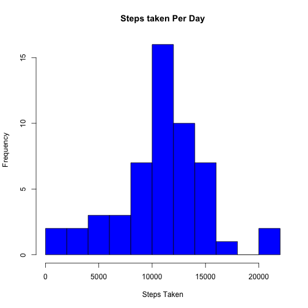
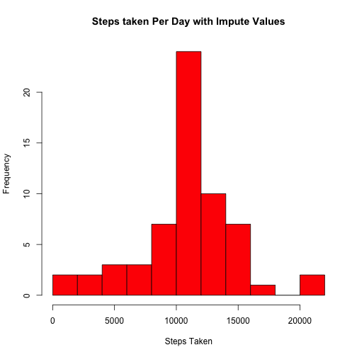
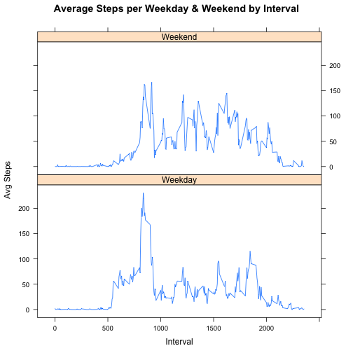

Reproducible Research: Peer Assessment 1
---------------------------------------------------------------------
This assignment is part of the coursera module Reproducible Research. This assignment makes use of data from a personal activity monitoring device. This device collects data at 5 minute intervals through out the day. The data consists of two months of data from an anonymous individual collected during the months of October and November, 2012 and include the number of steps taken in 5 minute intervals each day.

## Setting Global Variable
As we are require to display our codes to allow anyone to able to read the code, we will set the echo = TRUE as a global variable which applies throughout the whole report.

```r
library(knitr)
opts_chunk$set(echo = TRUE)
```

## Loading and preprocessing the data
We will check if there already exist activity.csv file. If no, we will proceed to unzip the activity.zip to get activity.csv file to be loaded.

```r
if (!file.exists("activity.csv")){
  unzip("activity.zip")
}

activityData <- read.csv("activity.csv")
```

Based on the data, it will be good to combine the date and interval to 1 column so that it will be easy for us to do computation and analyse (if required).

```r
## floor(activityData$interval/100) : Allow us to get the Hours of the time
## activityData$interval %% 100: Allow us to get the Minutes of the time
timeFormatted <- as.POSIXct(strptime(paste(sprintf("%02d", floor(activityData$interval/100)), 
                                           sprintf("%02d", (activityData$interval %% 100)), 
                                           rep.int(sprintf("%02d",0), nrow(activityData)), sep=":"),
                                     format="%H:%M:%S"))

## Retrieve only time from the above formatted time
timeOnly <- strftime(timeFormatted, format="%H:%M:%S")
## Create Date Time column by combining date and time together
dateTime <- paste(as.character(activityData$date), timeOnly, sep = " ")
## Add into activity dataset
activityData <- cbind(activityData, timeOnly, dateTime)
## Look at the data to make sure the above code perform as expected
str(activityData)
```

```
## 'data.frame':	17568 obs. of  5 variables:
##  $ steps   : int  NA NA NA NA NA NA NA NA NA NA ...
##  $ date    : Factor w/ 61 levels "2012-10-01","2012-10-02",..: 1 1 1 1 1 1 1 1 1 1 ...
##  $ interval: int  0 5 10 15 20 25 30 35 40 45 ...
##  $ timeOnly: Factor w/ 288 levels "00:00:00","00:05:00",..: 1 2 3 4 5 6 7 8 9 10 ...
##  $ dateTime: Factor w/ 17568 levels "2012-10-01 00:00:00",..: 1 2 3 4 5 6 7 8 9 10 ...
```

## What is mean total number of steps taken per day?
We will create a histogram to display the number of steps taken each day

```r
stepsPerDay <- aggregate(steps ~ date, activityData, sum)
## Create histogram with bin size/break of 10, this will allow user to visualize 
## and understand the distribution of the steps taken through out the days. 
hist(stepsPerDay$steps, col = "blue", main = "Steps taken Per Day", 
     xlab = "Steps Taken", ylab = "Frequency", breaks = 10)
```

 

Calculate the mean total number of steps taken per day

```r
meanPerDay <- mean(stepsPerDay$steps)
meanPerDay
```

```
## [1] 10766
```

Calculate the median of total number of steps taken per day

```r
medianPerDay <- median(stepsPerDay$steps)
medianPerDay
```

```
## [1] 10765
```

## What is the average daily activity pattern?
Plotting a time series of 5-minute interval and the average number of steps taken, averaged across all days


```r
stepsPerInterval <- aggregate(activityData$steps, by = list(interval = activityData$interval), 
                              mean, na.rm=TRUE)
names(stepsPerInterval) <- c("interval","steps")
plot(stepsPerInterval, type = "l", xlab = "5-minute interval", 
     ylab = "Avg. no. of steps taken across all days", main = "Average Daily Activity Pattern")
```

 

Identifying which interval has the most number of steps taken.

```r
## which.max returns the index or the row that contain the maximum number of steps
maxStepsInterval <- stepsPerInterval[which.max(stepsPerInterval$steps), 1]
maxStepsInterval
```

```
## [1] 835
```
The 5-minute interval contains the maximum number of steps is 835

## Imputing missing values
Calculate the total number of missing values in the dataset

```r
missingValues <- sum(!(complete.cases(activityData$steps)))
```
Total number of missing values in dataset is 2304

To replace the missing values, we decided to go with the mean for that 5-minute interval.

```r
## Create a function to replace the missing values based on the mean for that 5-minute interval
replaceValue <- function (dataset, meanDataset) {
    index <- which(is.na(dataset$steps))
    replace <- unlist(lapply(index, FUN=function(replacementIndex){
        meanDataset[meanDataset$interval == dataset[replacementIndex,]$interval,]$steps
    }))
    imputedSteps <- dataset$steps
    imputedSteps[index] <- replace
    imputedSteps
}
```

Create a new dataset that is equal to the original dataset but with the missing data filled in.

```r
## Create a new dataset with missing values replaced
activityDataImpute <- activityData
activityDataImpute$steps <- replaceValue(activityDataImpute, stepsPerInterval)
activityDataImpute$steps <- activityDataImpute$steps
```

To make sure that all missing data are filled, we will do a count of all missing data in the new dataset

```r
missingValuesFill <- sum(is.na(activityDataImpute$steps))
missingValuesFill
```

```
## [1] 0
```

We will create a histogram to display the number of steps taken each day for the dataset without missing values

```r
imputeStepsPerDay <- aggregate(steps ~ date, activityDataImpute, sum)
hist(imputeStepsPerDay$steps, col = "red", main = "Steps taken Per Day with Impute Values", 
     xlab = "Steps Taken", ylab = "Frequency", breaks = 10)
```

 

Calculate mean and median of the new dataset

```r
imputeMeanPerDay <- mean(imputeStepsPerDay$steps)
imputeMeanPerDay
```

```
## [1] 10766
```

```r
imputeMedianPerDay <- median(imputeStepsPerDay$steps)
imputeMedianPerDay
```

```
## [1] 10766
```

Before replacing the missing values:
Mean: 1.0766 &times; 10<sup>4</sup>
Median: 10765

After replacing the missing values:
Mean: 1.0766 &times; 10<sup>4</sup>
Median: 1.0766 &times; 10<sup>4</sup>

Looking at the values of the mean and median before and after replacing the missing values, we can conclude that the mean did not change. However, there is a slight increase in the median. Therefore, the impact of replacing the missing values is an increase in the median, but it does not affect negatively on the prediction. This can be further prove by the 2 histograms which shows normal distribution in both cases.

## Are there differences in activity patterns between weekdays and weekends?
Creating factor variable in the dataset with 2 levels indicating whether a given date in the dataset is a weekday or a weekend day. 

```r
day_type <- function(date){
  if(weekdays(as.Date(date)) %in% c("Sunday","Saturday")){
      "Weekend"
  }
  else{
      "Weekday"
  }
}
activityDataImpute$day <- as.factor(sapply(activityDataImpute$date, day_type))
```

Plotting a time series of 5-minute interval and the average number of steps taken, averaged across all weekday days and weekend days.

```r
imputeStepsPerDayType <- aggregate(steps ~ interval + day, activityDataImpute, mean)
library(lattice)
xyplot(imputeStepsPerDayType$steps ~ imputeStepsPerDayType$interval|imputeStepsPerDayType$day, 
       main="Average Steps per Weekday & Weekend by Interval", xlab ="Interval", ylab ="Avg Steps",
       layout=c(1,2), type ="l")
```

 

Based on the time series plot, we can observe that the activities for both weekdays and weekends are different. For weekdays, there is a peak in the morning which is eariler part of the day. For weekends, the activities start at a later part of the day and overall number of steps taken is more than weekday. 


